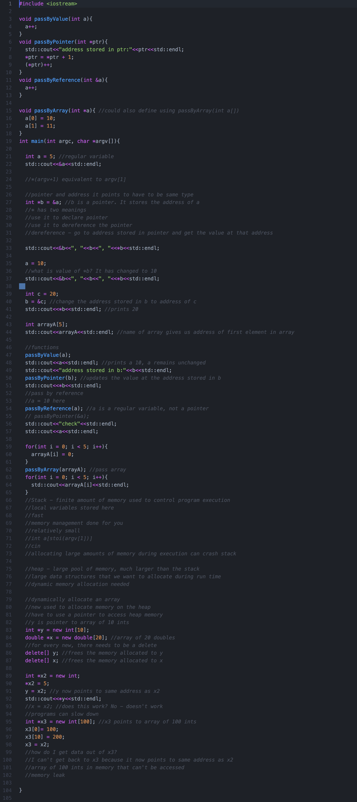
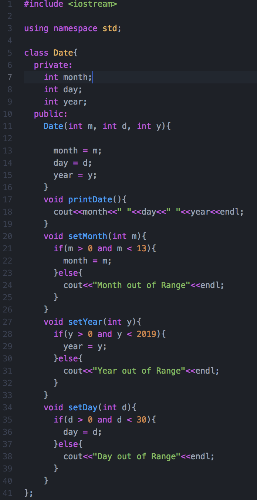
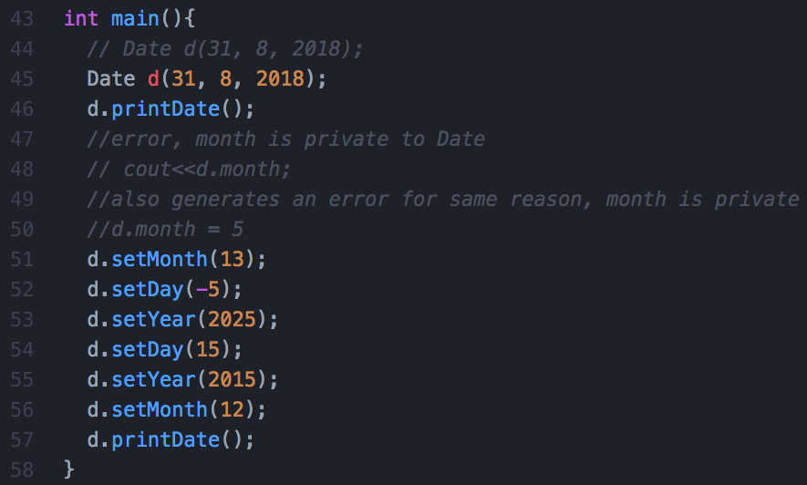
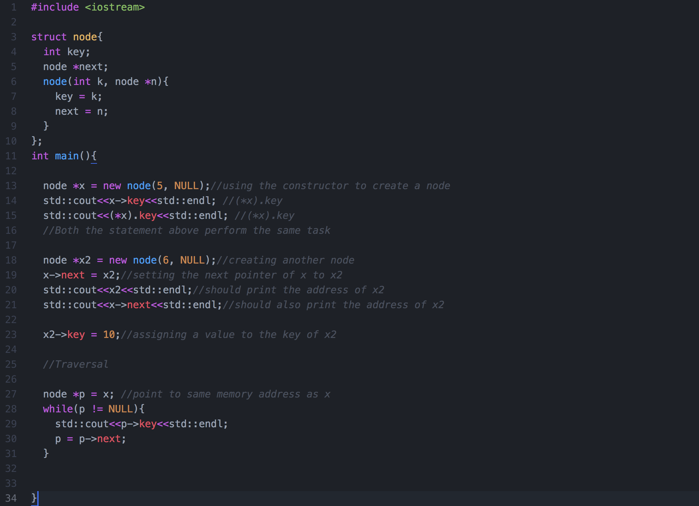
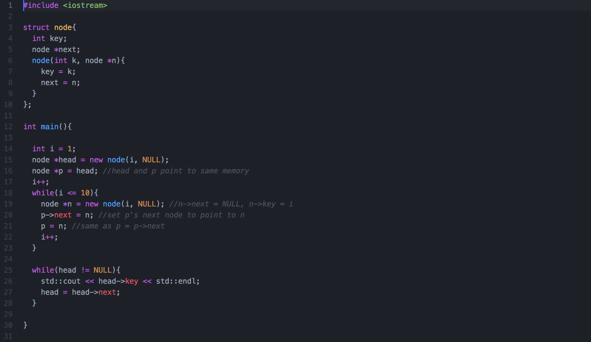
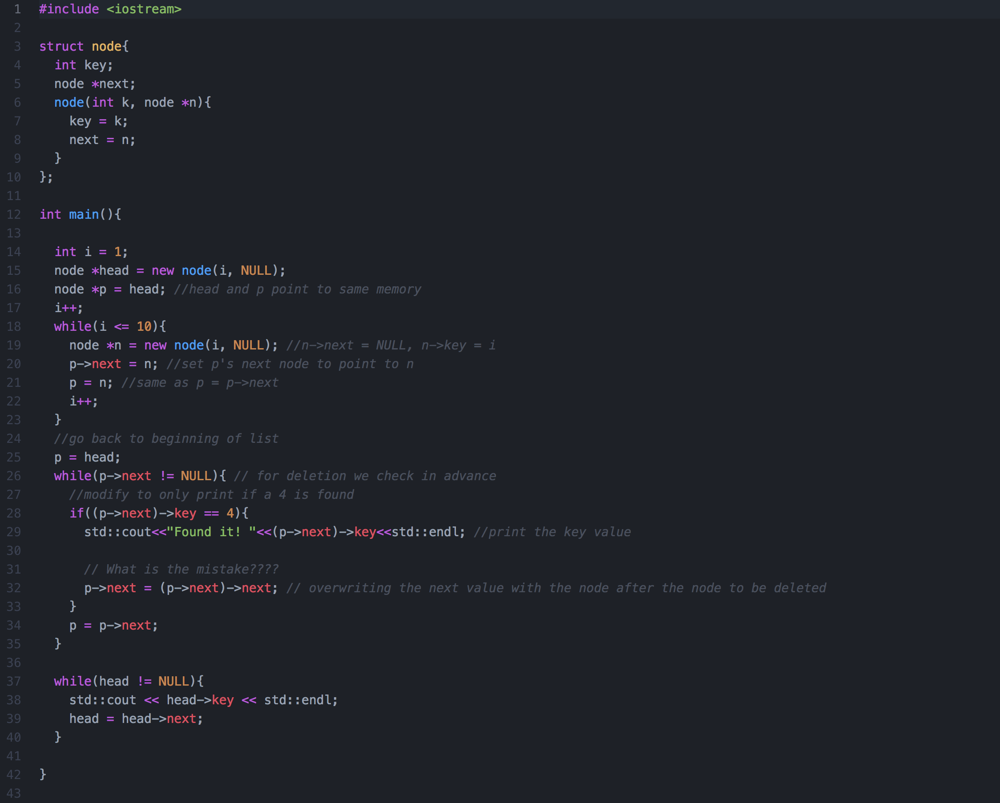
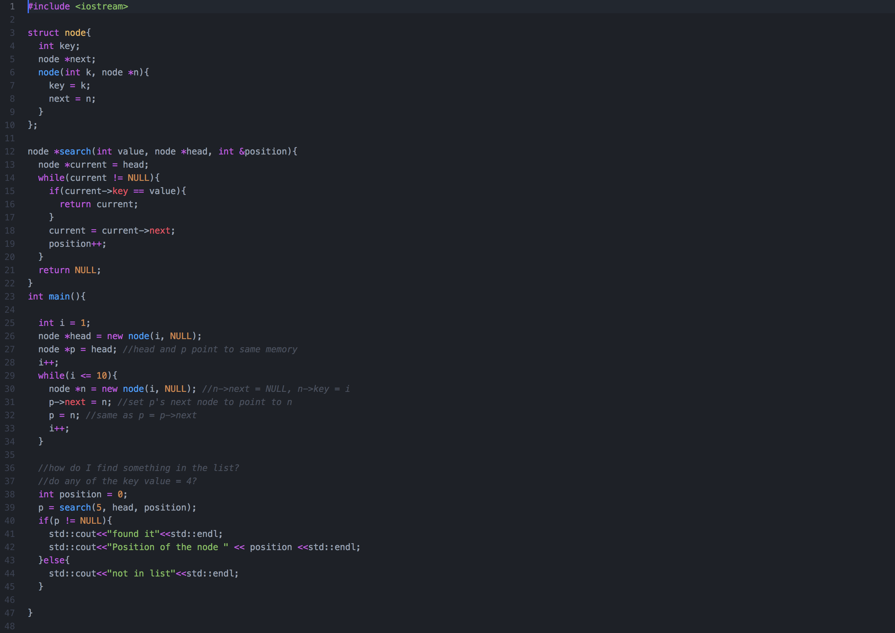

<h1>Dynamic Memory



<h1>Array Doubling
```
if(currentArraySize == maxArraySize)
{
     Node *newArray = new Node[arrayLength*2];
     //Copys the old array too the new array
     for(int i = 0; i<arrayLength; i++)
     {
          newArray[i] = array[i];
     }

     maxArraySize *= 2;
     delete[] array;
     array = newArray;
}
```

<h1>Array Halving
```
if(currentArraySize == maxArraySize/2 && currentArraySize > minSize-1)
{
     int* newArray = new int[arrayLength/2];
     for(int i = 0; i<arrayLength; i++)
     {
          newArray[i] = array[i];
     }
     delete[] array;
     array = newArray;
     maxArraySize /= 2;
}
```

<h1>Classes




<h1>Node
```
struct Country
{
    std::string name;         // name of the country
    std::string message;      // message this country has received
    int numberMessages;       // no. of messages passed through this country
    Country *next;            // pointer to the next country
};
```

<h1>Linked List Creation



<h1>Adding to a linked list



```
void CountryNetwork::insertCountry(Country* previous, string countryName)
{
     //If there have been no counries added yet...
     if(previous == NULL)
     {
          Country* newCountry = new Country();
          newCountry->name = countryName;
          //If the user wants to put in a country at the front of the list
          if(head != NULL)
          {
               newCountry->next = head;
          }
          head = newCountry; //Makes the first addition the head of the linked list
     }
     //If the head of the linked list is established
     else
     {
          Country* newCountry = new Country();
          newCountry->name = countryName;
          if(previous->next != NULL)
          {
               newCountry->next = previous->next;
          }
          previous->next = newCountry; //Set the new country as the next element in the linked list
     }
}
```

<h1>Removing from a linked list



<h3>Example 1
```
Node *deleteNegatives(Node *head)
{
     Node* p = head;

     if(p->key < 0)
     {
          Node* toBeDeleated = p;
          head = p->next;
          delete toBeDeleated;
          p = head->next;
     }

     while(p->next != NULL)
     {
          if((p->next)->key < 0)
          {
               Node* toBeDeleated = p->next;
               p->next = (p->next)->next;
               delete toBeDeleated;
          }
          else
          {
               p = p->next;
          }
     }

     if(p->key < 0)
     {
          delete p;
     }

     return head;
}
```

<h3>Example 2
```
void CountryNetwork::deleteCountry(string countryName)
{
     bool countryFound = false; //A bool used to see if the country exists or not
     Country* p = head;

     //If the first element in the linked list should be deleted...
     if(p->name == countryName)
     {
          Country* toBeDeleated = p; //Store it in a new instance
          head = p->next; //Set a new head
          delete toBeDeleated; //Delete the node;
          countryFound = true;
     }

     //While there are elements in the linked list
     while(p->next != NULL)
     {
          //If the next item in the linked list is the one to be deleted...
          if((p->next)->name == countryName)
          {
               Country* toBeDeleated = p->next; //Store it in a new instance
               p->next = (p->next)->next; //Link the current node too the one for deletion was pointing too
               delete toBeDeleated; //Delete the node;
               countryFound = true;
          }
          //If the country was not found then keep working down the linked list
          else
          {
               p = p->next;
          }
     }
}
```

<h1>Traversing Linked list



```
Country* CountryNetwork::searchNetwork(string countryName)
{
     Country* p = head;

     //Checks if the head has been established yet
     if(head == NULL)
     {
          return NULL;
     }

     //Checks if the first node is the one we are looking for
     if(p->name == countryName)
     {
          return p;
     }

     //While there are items in the linked list...
     while(p->next != NULL)
     {
          //If this node is the one we are looking for...
          if(p->name == countryName)
          {
               return p;
          }
          //Else move on too the next one.
          else
          {
               p = p->next;
          }
     }

     //Checks if the last node is the one we are looking for
     if(p->name == countryName)
     {
          return p;
     }

     return NULL;
}
```

<h1>Reversing a linked list
```
void CountryNetwork::reverseEntireNetwork()
{
     Country* lastNode = NULL;
     Country* currentNode = head;
     Country* nextNode = NULL;

     while(currentNode != NULL)
     {
          nextNode = currentNode->next;
          currentNode->next = lastNode;
          lastNode = currentNode;
          currentNode = nextNode;
     }

     head = lastNode;
}
```

<h1>Destructor
```
Operand* toBeDeleted;

if(stackHead == NULL)
{
     return;
}

//While their is more then one Operand
while(stackHead->next != nullptr)
{
     toBeDeleted = stackHead;
     stackHead = stackHead->next;
     delete toBeDeleted;
}

//Deletes the final Operand
delete stackHead;
```

<h1>Push to stack
```
//If there is nothing in the stack...
if(isEmpty())
{
     //Create the first head
     Operand* op = new Operand;
     op->number = num;
     op->next = nullptr;
     stackHead = op;
}
//If there are already elements...
else
{
     //Make the new elelment the head
     Operand* op = new Operand;
     op->number = num;
     op->next = stackHead;
     stackHead = op;
}
```

<h1>Pop from stack
```
//If the stack is empty...
if(isEmpty())
{
     std::cout << "Stack empty, cannot pop an item." << '\n';
}
//If the stack is not empty...
else
{
     //Remove the head and make the next item be the head
     Operand* temp = stackHead;
     stackHead = stackHead->next;
     delete temp;
}
```

<h1>Peek stack
```
if(isEmpty())
{
     std::cout << "Stack empty, cannot peek." << '\n';
     return NULL;
}
else
{
     //StackHead sould always be on top of the stack
     return stackHead;
}
```

<h1>Check if circular queue is full
```
{
     //If the queue has 20 items in it
     if((queueEnd+1)%SIZE == queueFront)
     {
          return true;
     }
     else
     {
          return false;
     }
```

<h1>Enqueue in a circular array
```
//If the queue is empty...
if(isEmpty())
{
     //Set the first element of the queue
     queueEnd++;
     queueFront++;

     queue[queueEnd] = item;
}
//If it is not empty and not full...
else if(!isFull())
{
     //Add the element too the queue
     queueEnd++;
     queueEnd = queueEnd%SIZE;
     queue[queueEnd%SIZE] = item;
}
//If the queue is full...
else
{
     std::cout << "Queue full, cannot add new item" << '\n';
}
```

<h1>Dequeue in a circular array
```
//If the queue is empty...
if(isEmpty())
{
     std::cout << "Queue empty, cannot dequeue an item" << '\n';
}
//If the queue is not empty...
else
{
     //Remove items from the front of thbe queue
     queueFront++;
     queueFront = queueFront%SIZE;
}

//If the queue is empty then reset the queue start and end too negetive 1
if(queueFront-1 == queueEnd)
{
     queueEnd = -1;
     queueFront = -1;
}
```

<h1>Binary Trees
<h4>Full

A full binary tree is a tree in which every node has either 0 or 2 children.

<h4>Complete

In a complete binary tree every level, except possibly the last, is completely filled, and all nodes in the last level are as far left as possible.

<h4>Perfect

A perfect binary tree is a binary tree in which all interior nodes have two children and all leaves have the same depth or same level.

# Trees

### Trees: Unlike Arrays, Linked Lists, Stack and queues, which are linear data structures, trees are hierarchical data structures.
###Tree Vocabulary: The topmost node is called root of the tree. The elements that are directly under an element are called its children. The element directly above something is called its parent. For example, ‘a’ is a child of ‘f’, and ‘f’ is the parent of ‘a’. Finally, elements with no children are called leaves.
```
      tree
      ----
       j    <-- root
     /   \
    f      k
  /   \      \
 a     h      z    <-- leaves
```
##Why Trees?
### 1. One reason to use trees might be because you want to store information that naturally forms a hierarchy. For example, the file system on a computer:
```
file system
-----------
     /    <-- root
  /      \
...       home
      /          \
   ugrad        course
    /       /      |     \
  ...      cs101  cs112  cs113

```

### 2. Trees (with some ordering e.g., BST) provide moderate access/search (quicker than Linked List and slower than arrays).
### 3. Trees provide moderate insertion/deletion (quicker than Arrays and slower than Unordered Linked Lists).
### 4. Like Linked Lists and unlike Arrays, Trees don’t have an upper limit on number of nodes as nodes are linked using pointers.
<br>

### Main applications of trees include:
1. Manipulate hierarchical data.
2. Make information easy to search (see tree traversal).
3. Manipulate sorted lists of data.
4. As a workflow for compositing digital images for visual effects.
5. Router algorithms
6. Form of a multi-stage decision-making (see business chess).


## Binary Tree: A tree whose elements have at most 2 children is called a binary tree. Since each element in a binary tree can have only 2 children, we typically name them the left and right child.

Source: GeeksForGeeks, there are advacned reads like number of nodes in a level etc.

## Types of Binary trees

### Full Binary Tree A Binary Tree is full if every node has 0 or 2 children. Following are examples of full binary tree. We can also say a full binary tree is a binary tree in which all nodes except leaves have two children.
```
               18
           /       \
         15         30
        /  \        /  \
      40    50    100   40
```
```
             18
           /    \
         15     20
        /  \
      40    50
    /   \
   30   50
```
```
               18
            /     \
          40       30
                   /  \
                 100   40

```

### In a Full Binary, number of leaf nodes is number of internal nodes plus 1
###       L = I + 1
### Where L = Number of leaf nodes, I = Number of internal nodes


### Complete Binary Tree: A Binary Tree is complete Binary Tree if all levels are completely filled except possibly the last level and the last level has all keys as left as possible

### Following are examples of Complete Binary Trees

```

               18
           /       \
         15         30
        /  \        /  \
      40    50    100   40

```
```
               18
           /       \
         15         30
        /  \        /  \
      40    50    100   40
     /  \   /
    8   7  9

```

### Practical example of Complete Binary Tree is Binary Heap.


### Perfect Binary Tree A Binary tree is Perfect Binary Tree in which all internal nodes have two children and all leaves are at same level.
### Following are examples of Perfect Binaryr Trees.
```
               18
           /       \
         15         30
        /  \        /  \
      40    50    100   40
```
```

               18
           /       \
         15         30
```

### A Perfect Binary Tree of height h (where height is number of nodes on path from root to leaf) has 2h – 1 node.

### Example of Perfect binary tree is ancestors in family. Keep a person at root, parents as children, parents of parents as their children.


### Balanced Binary Tree
### A binary tree is balanced if height of the tree is O(Log n) where n is number of nodes. For Example, AVL tree maintain O(Log n) height by making sure that the difference between heights of left and right subtrees is 1. Red-Black trees maintain O(Log n) height by making sure that the number of Black nodes on every root to leaf paths are same and there are no adjacent red nodes. Balanced Binary Search trees are performance wise good as they provide O(log n) time for search, insert and delete.


### A degenerate (or pathological) tree A Tree where every internal node has one child. Such trees are performance-wise same as linked list.
```
      10
      /
    20
     \
     30
      \
      40
```

# BSTs - Binary Search trees

### Binary Search Tree is a node-based binary tree data structure which has the following properties:

### The **left** subtree of a node contains only nodes with keys **lesser than the node’s key**.
### The **right** subtree of a node contains only nodes with keys **greater than the node’s key**.
### The **left and right subtree** each **must also be a binary search tree**.
